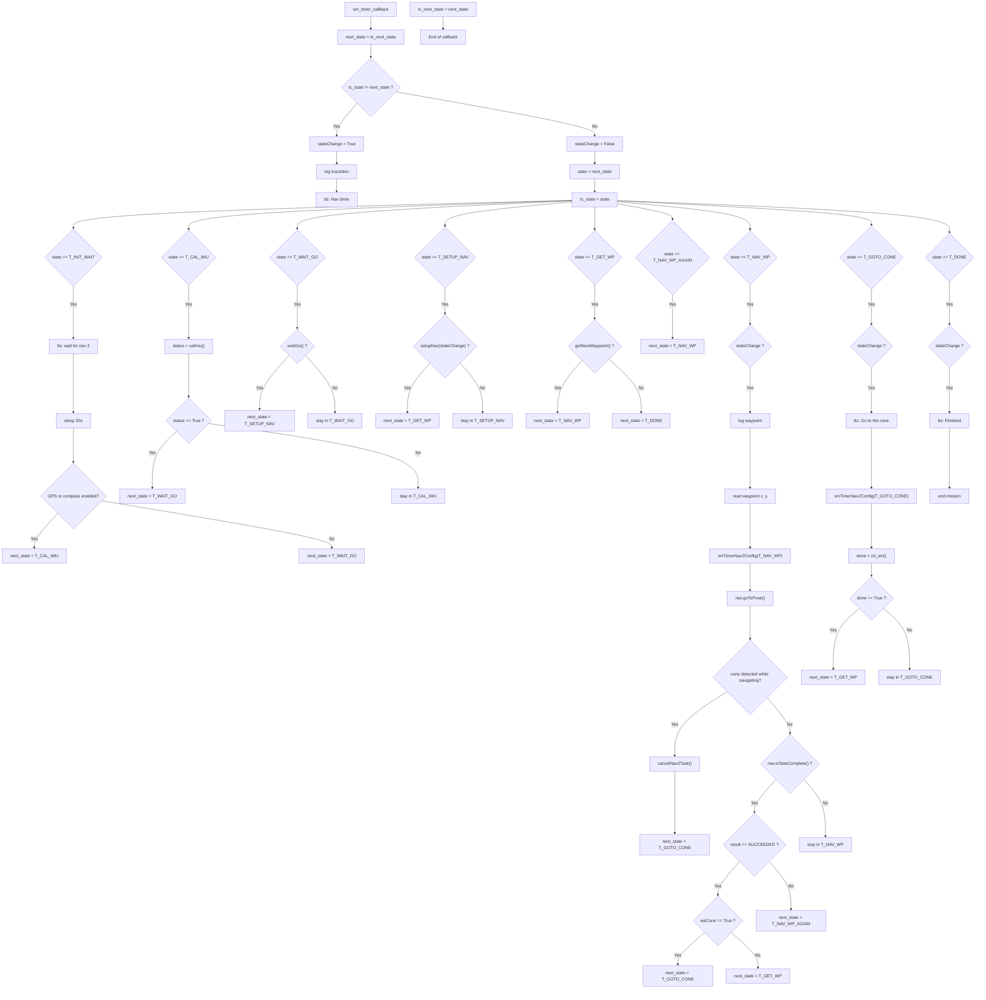

# NavNode State Machine

This diagram is based on the transition logic inside `sm_timer_callback` in [src/robocolumbus_stuff/robocolumbus_stuff/nav_node.py](src/robocolumbus_stuff/robocolumbus_stuff/nav_node.py).
